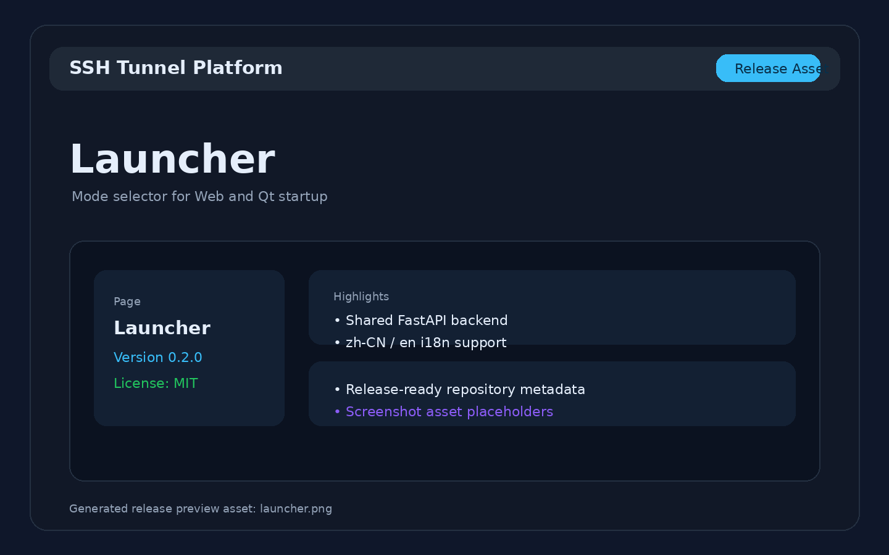
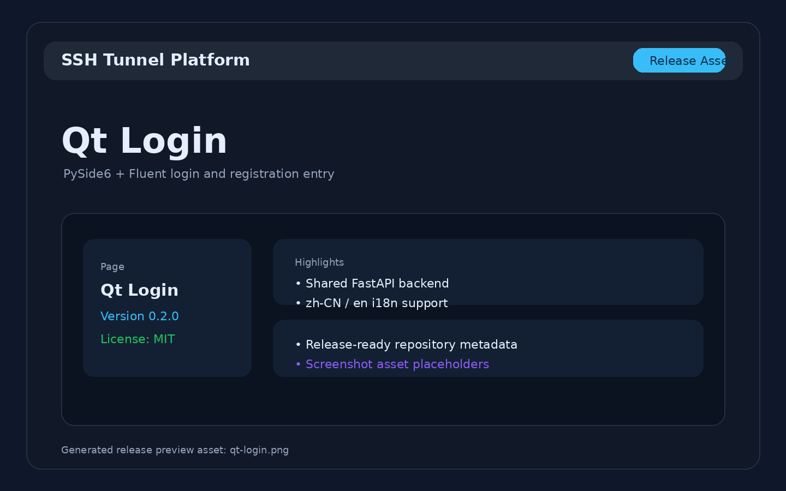
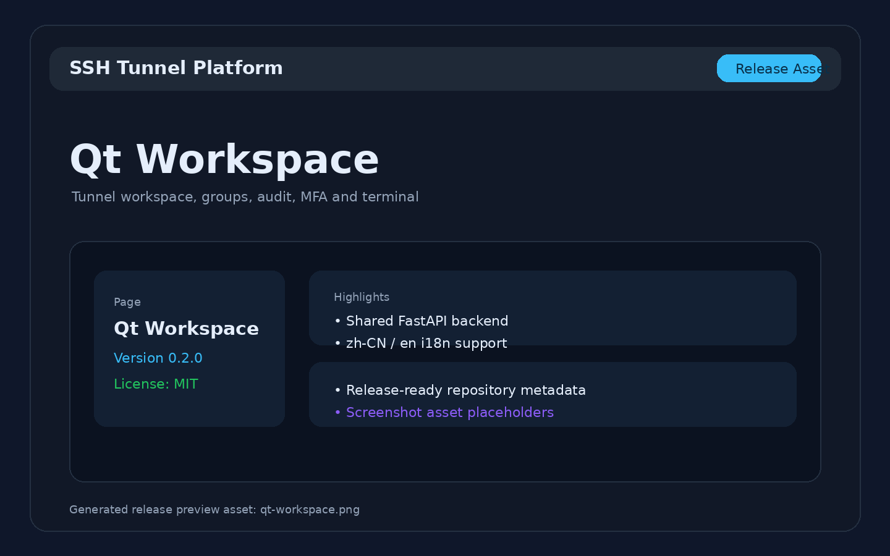
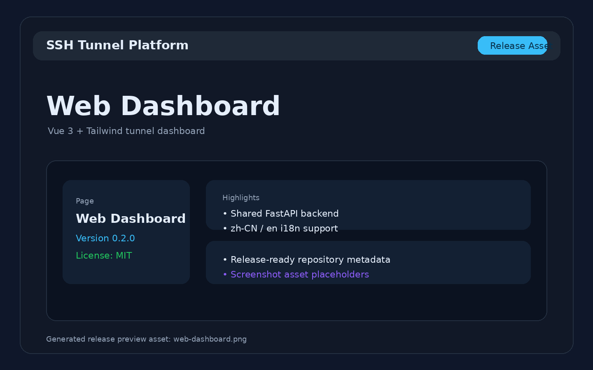
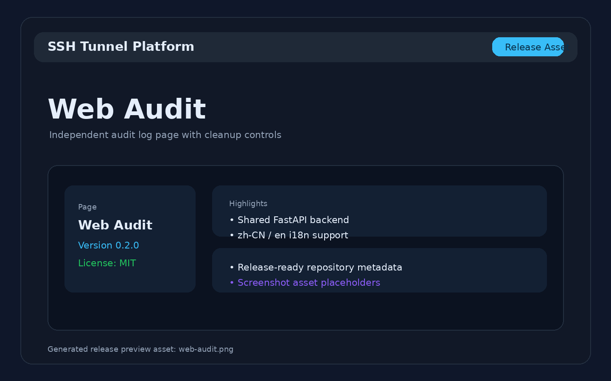

# SSH 隧道平台 (SSH Tunnel Platform)

> 一个基于 Python 的 SSH 隧道控制平台，提供账号注册、按用户持久化的隧道配置、自定义分组、独立审计日志页和交互式 Web SSH 终端。

[](https://www.python.org/)
[](https://fastapi.tiangolo.com/)
[](https://asyncssh.readthedocs.io/)
[](./LICENSE)
[](./VERSION)

---

## 目录

- [功能特性](#功能特性)
- [系统架构](#系统架构)
- [数据流](#数据流)
- [项目结构](#项目结构)
- [快速开始](#快速开始)
- [发布信息](#发布信息)
- [截图预览](#截图预览)
- [使用指南](#使用指南)
- [API 概览](#api-概览)
- [安全设计](#安全设计)
- [扩展方向](#扩展方向)

---

## 功能特性

| 类别 | 功能 |
|------|------|
| 🔐 **认证** | 账号注册/登录、预置管理员账号、TOTP 两步验证 (MFA) |
| 🔗 **隧道** | 本地端口转发、SOCKS5 动态代理、按用户持久化保存、退出登录时保存/丢弃 |
| 🗂️ **分组** | 我的隧道支持自定义分组、分组重命名、清空分组 |
| 🖥️ **Web SSH** | 基于 xterm.js 的交互式 Web 终端，双向实时通信 |
| 📋 **审计** | 完整的操作审计日志（登录/隧道创建/命令执行）+ 独立日志页面 + 24h/7d/30d/90d 清理 |
| 🛡️ **权限** | 基于 IP/端口的 ACL 访问控制 |
| 🎨 **前端** | Vue 3 + TailwindCSS 仪表盘、独立审计日志页、xterm.js 终端 |
| 🔌 **可扩展** | SSH 后端抽象层，支持多实现；插件化认证系统 |

---

## 发布信息

| 项目项 | 当前值 |
|------|------|
| 项目名称 | `SSH Tunnel Platform` |
| 当前版本 | `0.2.0` |
| 许可证 | `MIT` |
| 项目简介 | 基于 Python 的 SSH 隧道控制平台，提供 Web 仪表盘与 Qt 桌面工作台，共享同一套 FastAPI 后端。 |
| 桌面启动入口 | `python main.py` |
| API / Web 启动入口 | `python -m uvicorn apps.api.main:app --host 0.0.0.0 --port 18002` |

关联发布文件：

- [LICENSE](./LICENSE)
- [VERSION](./VERSION)
- [PROJECT_SUMMARY.md](./PROJECT_SUMMARY.md)

---

## 截图预览

### 启动选择页



### Qt 登录页



### Qt 工作台



### Web 仪表盘



### 审计日志页



### Web 终端页


---

## 系统架构

### 总体架构（分层 + 解耦）

```
┌─────────────────────────────────────────────────────────────┐
│                      用户 / 客户端                            │
│                (浏览器 / curl / 第三方应用)                    │
└─────────────┬───────────────────────────────┬───────────────┘
              │                               │
              ▼                               ▼
┌─────────────────────────┐     ┌─────────────────────────────┐
│      Web 前端 (Static)   │     │      API 接口 (REST/WS)     │
│  • index.html (仪表盘)   │◄───►│  • FastAPI 路由             │
│  • audit.html (审计页)   │     │  • WebSocket 终端通道       │
│  • terminal.html (终端)  │     │  • CORS 跨域支持            │
│  • TailwindCSS + Vue 3   │     │                             │
└─────────────────────────┘     └─────────────┬───────────────┘
                                              │
                    ┌─────────────────────────┼─────────────────────────┐
                    │                   控制层 (Apps)                     │
                    │  • apps/api/main.py        — API 入口             │
                    │  • apps/api/routes/        — 路由分发             │
                    │  • apps/worker/            — 执行节点（预留）      │
                    └─────────────────────────┬─────────────────────────┘
                                              │
                    ┌─────────────────────────┼─────────────────────────┐
                    │                  业务层 (Services)                  │
                    │  • tunnel_service.py  — 隧道 CRUD + 终端会话      │
                    │  • 权限校验 → 调用模块 → 审计记录                  │
                    └─────────────────────────┬─────────────────────────┘
                                              │
         ┌────────────────┬──────────────────┼──────────────────┬────────────────┐
         ▼                ▼                  ▼                  ▼                ▼
┌─────────────┐  ┌──────────────┐  ┌──────────────┐  ┌──────────────┐  ┌──────────────┐
│ modules/ssh  │  │modules/tunnel│  │ modules/auth │  │ modules/acl  │  │modules/audit │
│   SSH 后端    │  │   隧道管理    │  │   认证系统    │  │   权限控制    │  │   审计日志    │
│              │  │              │  │              │  │              │  │              │
│ • AsyncSSH   │  │ • 端口转发    │  │ • 密码认证    │  │ • 策略定义    │  │ • 日志记录    │
│ • OpenSSH    │  │ • SOCKS5     │  │ • TOTP/MFA   │  │ • 评估引擎    │  │ • 数据模型    │
│ (预留扩展)   │  │ • 终端会话    │  │ • OAuth(预留) │  │              │  │              │
└──────┬───────┘  └──────┬───────┘  └──────┬───────┘  └──────┬───────┘  └──────┬───────┘
       │                 │                 │                 │                 │
       └─────────────────┴────────┬────────┴─────────────────┴─────────────────┘
                                  │
                    ┌─────────────┴─────────────┐
                    │     基础设施 (Infra)        │
                    │                            │
                    │  • SQLite / aiosqlite      │
                    │  • Redis (预留)            │
                    │  • 消息队列 (预留)          │
                    │  • 密钥存储                │
                    └─────────────────────────────┘
```

### 隧道创建流程

```
  ┌──────────┐      ┌──────────────┐      ┌──────────────┐      ┌──────────────┐
  │  浏览器    │      │  FastAPI      │      │ TunnelService│      │ TunnelManager│
  │ (前端)    │      │  (控制层)     │      │  (业务层)     │      │  (模块层)     │
  └────┬─────┘      └──────┬───────┘      └──────┬───────┘      └──────┬───────┘
       │                   │                     │                     │
       │ POST /tunnel/create│                    │                     │
       │──────────────────►│                    │                     │
       │                   │                    │                     │
       │                   │ create_tunnel()    │                     │
       │                   │───────────────────►│                     │
       │                   │                    │                     │
       │                   │                    │ 1. ACL 权限校验     │
       │                   │                    │────┐                │
       │                   │                    │    │                │
       │                   │                    │◄───┘                │
       │                   │                    │                     │
       │                   │                    │ 2. 调用业务模块      │
       │                   │                    │────────────────────►│
       │                   │                    │                     │
       │                   │                    │                     │ connect()
       │                   │                    │                     │──────────►
       │                   │                    │                     │  SSH Server
       │                   │                    │                     │◄──────────
       │                   │                    │                     │
       │                   │                    │                     │ forward_port()
       │                   │                    │                     │──────────►
       │                   │                    │                     │
       │                   │                    │     返回 tunnel_id   │
       │                   │                    │◄────────────────────│
       │                   │                    │                     │
       │                   │                    │ 3. 写入审计日志       │
       │                   │                    │────┐                │
       │                   │                    │    │                │
       │                   │                    │◄───┘                │
       │                   │                    │                     │
       │                   │◄───────────────────│                     │
       │                   │                    │                     │
       │◄──────────────────│                    │                     │
       │   { tunnel_id }   │                    │                     │
```

### Web SSH 终端数据流

```
  ┌─────────────────┐                         ┌─────────────────────┐
  │   浏览器 (前端)    │                         │    SSH Server (远程)  │
  │                 │                         │                     │
  │  ┌───────────┐  │   WebSocket              │  ┌───────────────┐  │
  │  │  xterm.js  │  │◄═══════════════════════►│  │   bash shell   │  │
  │  │  终端渲染   │  │   /ws/terminal/{id}     │  │   交互式进程    │  │
  │  └─────┬─────┘  │                         │  └───────┬───────┘  │
  │        │        │                         │          │          │
  │  用户输入        │     ┌───────────────┐    │     stdin/stdout   │
  │  "ls -l"        │     │  FastAPI       │    │          │          │
  │        │        │     │  WebSocket路由  │    │  ┌───────┴───────┐  │
  │        ▼        │     │               │    │  │ SSHClient     │  │
  │  WS.send(text)  │────►│  write_task()  │────│──► Process      │  │
  │                 │     │       │        │    │  │               │  │
  │                 │     │       ▼        │    │  │ stdin.write() │  │
  │                 │     │  process.stdin │    │  └───────┬───────┘  │
  │                 │     │     .write()   │    │          │          │
  │                 │     │               │    │          ▼          │
  │                 │     │  read_task()   │    │  ┌───────────────┐  │
  │                 │     │       ▲        │    │  │ 命令执行结果    │  │
  │  WS接收数据      │◄────│  process.stdout│◄───│──│ stdout.read() │  │
  │        │        │     │     .read()    │    │  └───────────────┘  │
  │        ▼        │     └───────────────┘    │                     │
  │  xterm.write()  │                         └─────────────────────┘
  │  屏幕实时渲染     │
  └─────────────────┘
```

---

## 项目结构

```
ssh_gateway_project_v2/
│
├── apps/                     # 应用入口
│   ├── api/                  # 控制层 (FastAPI)
│   │   ├── main.py           # API 入口、路由注册、静态文件服务
│   │   └── routes/           # API 路由
│   │       ├── auth.py       # 认证 (注册/登录/MFA)
│   │       ├── tunnel.py     # 隧道 CRUD + WebSocket 终端
│   │       └── admin.py      # 管理接口
│   ├── worker/               # 执行层（预留—多节点调度）
│   └── cli/                  # CLI 工具（预留）
│
├── services/                 # 业务逻辑层
│   └── tunnel_service.py     # 隧道服务 (ACL校验 → 调用模块 → 审计)
│
├── modules/                  # 核心模块
│   ├── ssh/                  # SSH 抽象层
│   │   ├── base.py           # 后端抽象接口
│   │   └── asyncssh_backend.py # AsyncSSH 实现
│   ├── tunnel/               # 隧道管理
│   │   └── manager.py        # 隧道 + 终端会话管理
│   ├── auth/                 # 认证系统
│   │   ├── password.py       # 密码认证
│   │   └── mfa/
│   │       ├── base.py       # MFA 抽象接口
│   │       └── totp.py       # TOTP 实现 (QR码 + 验证)
│   ├── acl/                  # 权限控制
│   │   ├── policy.py         # 策略定义
│   │   └── evaluator.py      # 评估引擎
│   └── audit/                # 审计日志
│       ├── logger.py
│       └── models.py
│
├── infra/                    # 基础设施
│   ├── db/sqlite.py          # SQLite (aiosqlite)
│   ├── cache/                # 缓存 (预留 Redis)
│   ├── queue/                # 消息队列 (预留)
│   └── storage/              # 存储 (预留)
│
├── core/                     # 核心基础
│   ├── config.py             # 全局配置 (Pydantic Settings)
│   ├── logger.py             # 日志配置
│   ├── security.py           # 安全工具 (预留)
│   └── exceptions.py         # 异常定义 (预留)
│
├── web/                      # 前端静态页面
│   ├── index.html            # 仪表盘 (TailwindCSS + Vue 3)
│   ├── audit.html            # 独立审计日志页面
│   └── terminal.html         # Web SSH 终端 (Vue 3 + xterm.js)
│
├── schemas/                  # 数据模型定义（预留）
├── scripts/                  # 工具脚本
├── tests/                    # 测试文件
│
├── keys/                     # SSH 主机密钥
├── deploy/                   # 部署配置
│
├── LICENSE                   # MIT 许可证
├── VERSION                   # 当前版本号
├── PROJECT_SUMMARY.md        # 发布简介
├── assets/screenshots/       # 发布截图资源
├── requirements.txt          # Python 依赖
├── CHANGELOG.md              # 开发日志 & 使用说明
└── README.md                 # 本文件
```

---

## 快速开始

### 环境要求

| 组件 | 版本 |
|------|------|
| Python | 3.10+ |
| pip | 最新版 |
| 操作系统 | Linux / macOS / Windows (WSL) |

### 安装运行

```bash
# 1. 克隆项目
git clone <repository-url>
cd SSH-Tunnel-Platform

# 2. 安装依赖
pip install -r requirements.txt

# 3. 启动程序
python main.py
```

启动后会先进入模式选择页：

- `Web 使用`：启动内置 FastAPI 服务并打开浏览器版界面
- `Qt 使用`：启动基于 `PySide6 + PyQt-Fluent-Widgets` 风格的桌面端，功能与 Web 共用同一套后端接口

Qt 端已覆盖这些能力：

- 登录 / 注册
- 隧道创建、启动、停止、删除、编辑、验证
- 分组重命名、清空分组
- 审计日志查看与清理（管理员）
- MFA 配置与验证
- 命令执行
- 终端页内嵌打开（复用现有 Web terminal 页面）

```bash
# 4. 初始化示例账号（可选，但管理员功能推荐执行）
python scripts/init_mvp_data.py

# 5. 仅启动 API / Web 服务
python -m uvicorn apps.api.main:app --host 0.0.0.0 --port 18002

# 6. 打开浏览器
# http://localhost:18002
```

---

## 使用指南

### 1. 账号说明与登录

当前版本支持**注册普通账号**。如果需要管理员权限或示例账号，请先执行：

```bash
python scripts/init_mvp_data.py
```

示例账号：

| 账号类型 | 用户名 | 密码 |
|------|------|------|
| 普通用户 | `user` | `password` |
| 管理员 | `admin` | `admin` |

打开 `http://localhost:18002` 后，你可以直接注册普通账号，或使用已有账号登录。

### 2. 启用 MFA（推荐）

1. 登录后点击导航栏 **"启用 MFA"**
2. 用手机 TOTP App（Google Authenticator / Microsoft Authenticator / Authy）扫描弹窗中的 QR 码
3. 输入 App 显示的 6 位验证码
4. 点击 **"验证并激活"**

### 3. 创建 SSH 隧道

点击 **"新建隧道"**，填写：

| 字段 | 说明 | 示例 |
|------|------|------|
| 隧道名称 | 自定义名称 | `我的测试隧道` |
| SSH 主机 | 目标 SSH 服务器 IP | `192.168.1.100` |
| SSH 端口 | SSH 服务端口 | `22` |
| SSH 用户名 | SSH 登录用户 | `root` |
| SSH 密码 | SSH 登录密码 | `********` |
| 本地端口 | 本机监听端口 | `8080` |
| 分组 | 自定义分组名称 | `生产环境` |
| 远程主机 | 转发目标地址 | `127.0.0.1` |
| 远程端口 | 转发目标端口 | `80` |
| 类型 | `local` 或 `socks5` | `local` |

### 4. 使用 Web SSH 终端

1. 在隧道列表中点击 **"终端"** 按钮
2. 等待连接建立，出现命令行提示符
3. 输入命令实时交互

### 5. 管理隧道

| 操作 | 说明 |
|------|------|
| ⚡ **验证** | SSH 连接存活检测，三色图标：绿色（正常）/ 黄色（检测中）/ 红色（断开） |
| ✏️ **修改** | 支持更新 SSH 参数、备注和分组；运行中的隧道会自动重建 |
| ▶️ **启动已保存隧道** | 已保存但未运行的隧道可以直接重新启动 |
| 🖥️ **终端** | 打开交互式 Web SSH 终端 |
| 🛑 **停止** | 停止隧道但保留当前账号下的保存记录 |
| 🗑️ **删除** | 删除当前账号下的隧道记录 |
| 🗂️ **分组管理** | 支持按分组展示、重命名分组、清空分组（移动到未分组） |
| 🚪 **退出登录** | 退出时可选择保存现有隧道，或直接丢弃当前账号的隧道记录 |

### 6. 查看审计日志

1. 使用 `admin` 账号登录首页
2. 点击首页中的 **"审计日志"** 按钮
3. 跳转到独立页面 `/audit.html`
4. 查看最近 100 条操作记录和成功/失败统计
5. 可按保留策略清理 `24h`、`7d`、`30d`、`90d` 之前的日志

审计日志页从首页独立出来，避免管理面板被长表格占满，同时保留管理员访问控制。

---

## API 概览

### 认证

| 方法 | 路径 | 说明 |
|------|------|------|
| `POST` | `/auth/register` | 用户注册 |
| `POST` | `/auth/login` | 用户登录 |
| `POST` | `/auth/mfa/setup` | MFA 初始化 (返回 QR 码) |
| `POST` | `/auth/mfa/verify` | MFA 验证码校验 |
| `GET` | `/auth/logs` | 获取最近 100 条审计日志（仅管理员） |
| `POST` | `/auth/logs/cleanup` | 按保留策略清理审计日志（仅管理员） |

### 隧道

| 方法 | 路径 | 说明 |
|------|------|------|
| `POST` | `/tunnel/create` | 创建隧道 |
| `GET` | `/tunnel/list` | 列出当前用户的隧道 |
| `GET` | `/tunnel/groups` | 列出当前用户的分组摘要 |
| `POST` | `/tunnel/start/{id}` | 启动已保存隧道 |
| `POST` | `/tunnel/verify/{id}` | 验证隧道连通性 (SSH 连接存活检测) |
| `POST` | `/tunnel/exec/{id}` | 执行命令 |
| `POST` | `/tunnel/update/{id}` | 修改隧道参数 (停止重建) |
| `POST` | `/tunnel/stop/{id}` | 停止隧道 |
| `DELETE` | `/tunnel/{id}` | 删除隧道记录 |
| `POST` | `/tunnel/groups/rename` | 重命名分组 |
| `POST` | `/tunnel/groups/clear` | 清空分组（移到未分组） |
| `POST` | `/tunnel/logout` | 退出登录时保存或丢弃当前用户隧道 |
| **WS** | `/tunnel/ws/terminal/{id}` | WebSocket 终端 |

---

## 安全设计

```
┌────────────────────────────────────────────────────────┐
│                      安全层次                            │
│                                                        │
│   ┌──────────────────────────────────────────────────┐ │
│   │  第一层：传输安全                                  │ │
│   │  • SSH 加密隧道                                   │ │
│   │  • 主机密钥验证 (known_hosts)                     │ │
│   └──────────────────────────────────────────────────┘ │
│                          │                             │
│   ┌──────────────────────┴──────────────────────────┐ │
│   │  第二层：认证安全                                 │ │
│   │  • bcrypt 密码哈希                                │ │
│   │  • TOTP 两步验证 (MFA)                            │ │
│   │  • 防暴力破解（登录限流）                          │ │
│   └──────────────────────────────────────────────────┘ │
│                          │                             │
│   ┌──────────────────────┴──────────────────────────┐ │
│   │  第三层：访问控制                                  │ │
│   │  • ACL 策略引擎 (IP/端口级别)                      │ │
│   │  • 角色权限控制 (预留 RBAC)                       │ │
│   └──────────────────────────────────────────────────┘ │
│                          │                             │
│   ┌──────────────────────┴──────────────────────────┐ │
│   │  第四层：审计追踪                                  │ │
│   │  • 全量操作审计日志                                │ │
│   │  • 敏感操作告警 (预留)                              │ │
│   └──────────────────────────────────────────────────┘ │
└────────────────────────────────────────────────────────┘
```

---

## 扩展方向

```
当前 (MVP)                        未来
─────────                        ────

 单用户认证  ─────────────────►  多用户 + RBAC
 单节点运行  ─────────────────►  多 Worker 分布式调度
 密码认证    ─────────────────►  OAuth2 + LDAP + SSO
 基础 ACL    ─────────────────►  Zero Trust 架构
 Web 终端    ─────────────────►  终端录屏回放
 本地 SQLite ─────────────────►  Redis + PostgreSQL
 简单插件    ─────────────────►  插件市场 + 热加载
```

---

## 设计原则

> - **分层架构** — API / Service / Module 三层解耦
> - **控制面与执行面分离** — API 与 Worker 独立部署
> - **自研协议** — 复用成熟库 (AsyncSSH)，不自研 SSHv2
> - **可插拔设计** — 认证 / SSH 后端 / 插件均可替换扩展
> - **安全第一** — 默认拒绝、审计全覆盖、最小权限

---

## 许可证

MIT License

---

> 💡 **更多详情**：请参阅 [CHANGELOG.md](./CHANGELOG.md) 了解开发日志和详细使用说明。
